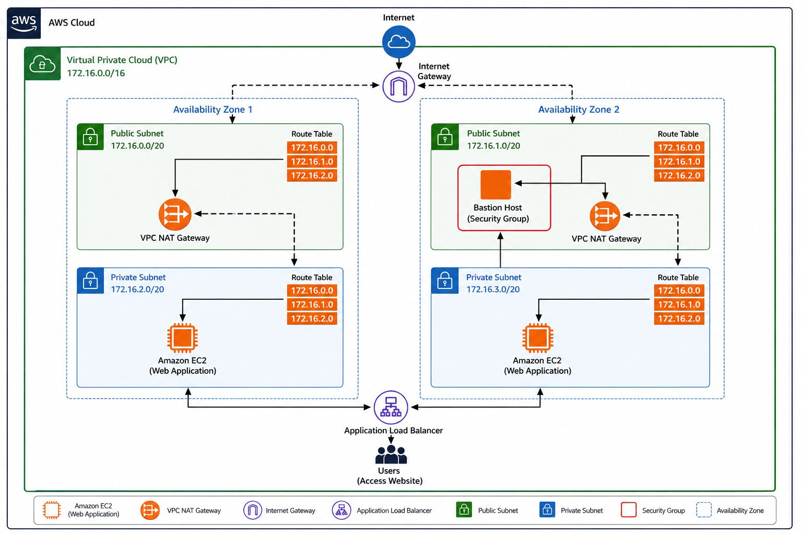

# 🚀 Highly Available AWS VPC Architecture

A production-style AWS networking project demonstrating the design and deployment of a **Highly Available Virtual Private Cloud (VPC)** across multiple Availability Zones. The architecture follows AWS networking best practices by combining **public and private subnets**, **Internet Gateway**, **NAT Gateway**, **Bastion Host**, and an **Application Load Balancer** to deliver a secure, scalable, and resilient infrastructure.

---

# 📖 Overview

This project focuses on building a secure and highly available network architecture on AWS.

The environment spans **two Availability Zones**, isolating workloads inside private subnets while providing secure administrative access through a Bastion Host and exposing applications through an Application Load Balancer.

The architecture demonstrates common production networking patterns used in modern cloud environments.

---

# 🏗️ Architecture

<p align="center">

</p>

---

# ☁️ AWS Services Used

- Amazon VPC
- Amazon EC2
- Internet Gateway
- NAT Gateway
- Elastic IP
- Application Load Balancer
- Route Tables
- Security Groups

---

# ⚙️ Technology Stack

| Category | Technologies |
|-----------|--------------|
| Cloud | AWS |
| Networking | Amazon VPC |
| Compute | Amazon EC2 |
| Load Balancing | Application Load Balancer |
| Security | Security Groups |
| Routing | Route Tables |
| Internet Access | Internet Gateway |
| Private Access | NAT Gateway |
| Administration | Bastion Host |

---

# 🏛️ Infrastructure Architecture

The infrastructure is deployed across **two Availability Zones** for improved availability.

### Availability Zone 1

- Public Subnet
- NAT Gateway
- Private EC2 Instance

### Availability Zone 2

- Public Subnet
- Bastion Host
- NAT Gateway
- Private EC2 Instance

Users access the application through an **Application Load Balancer**, while administrators securely connect to private instances through the **Bastion Host**.

---

# 🌐 Network Design

The VPC contains:

- 1 Virtual Private Cloud (VPC)
- 2 Availability Zones
- 2 Public Subnets
- 2 Private Subnets
- Internet Gateway
- NAT Gateway
- Application Load Balancer
- Bastion Host
- Private Web Servers

Each subnet is associated with its own route table to control network traffic.

---

# 🔐 Security Architecture

Security is implemented using AWS networking best practices.

### Public Layer

- Internet Gateway
- Bastion Host
- NAT Gateway
- Application Load Balancer

### Private Layer

- Web Application EC2 Instances
- No Direct Internet Access

Administrative access is only available through the Bastion Host.

---

# ⚖️ High Availability

The architecture improves availability by implementing:

- Multi-AZ Deployment
- Redundant Public & Private Subnets
- Load Balancing Across Instances
- Isolated Application Tier
- Fault-Tolerant Networking Design

---

# 🔄 Traffic Flow

```text
Users
   │
   ▼
Application Load Balancer
   │
   ├──────────────┐
   ▼              ▼
Private EC2    Private EC2
   │              │
   └──────┬───────┘
          │
      Private Subnets
          │
     NAT Gateway
          │
Internet Gateway
          │
       Internet

Administrator
      │
      ▼
 Bastion Host
      │
      ▼
 Private EC2
```

---

# 🚀 Key Features

- Highly Available VPC Design
- Multi-Availability Zone Deployment
- Public & Private Subnets
- Secure Bastion Host Access
- Application Load Balancer
- NAT Gateway for Private Internet Access
- Internet Gateway Integration
- Route Table Configuration
- Security Group Isolation
- Production-Style AWS Networking

---

# 📈 Key Learning Outcomes

Through this project, I gained hands-on experience with:

- Amazon VPC
- Public & Private Networking
- High Availability Design
- Internet Gateway
- NAT Gateway
- Application Load Balancer
- Bastion Host Architecture
- Route Tables
- Security Groups
- AWS Networking Best Practices

---

# 🛠️ Challenges Faced

- Designing CIDR Blocks
- Configuring Route Tables
- NAT Gateway Configuration
- Bastion Host Access
- Security Group Rules
- Multi-AZ Networking
- Application Load Balancer Target Groups
- Private Instance Connectivity


# 📸 Project Screenshots

- AWS VPC Dashboard
- Subnet Configuration
- Route Tables
- Internet Gateway
- NAT Gateway
- Bastion Host
- EC2 Instances
- Application Load Balancer
- Running Web Application

---

# 🔮 Future Improvements

- Auto Scaling Groups
- NAT Gateway per Availability Zone
- AWS WAF Integration
- Route 53 DNS
- ACM SSL/TLS Certificates
- CloudWatch Monitoring
- Terraform Automation
- AWS Transit Gateway
- VPC Flow Logs

---

# 👨‍💻 Author

**Eranga Kavishanka**

- AWS Certified Cloud Practitioner (AWS CCP)
- Kubernetes and Cloud Native Associate (KCNA)
- Software Engineering Undergraduate
- DevOps | Cloud | Site Reliability Engineering (SRE)

---

## ⭐ If you found this project useful, consider giving it a Star!
